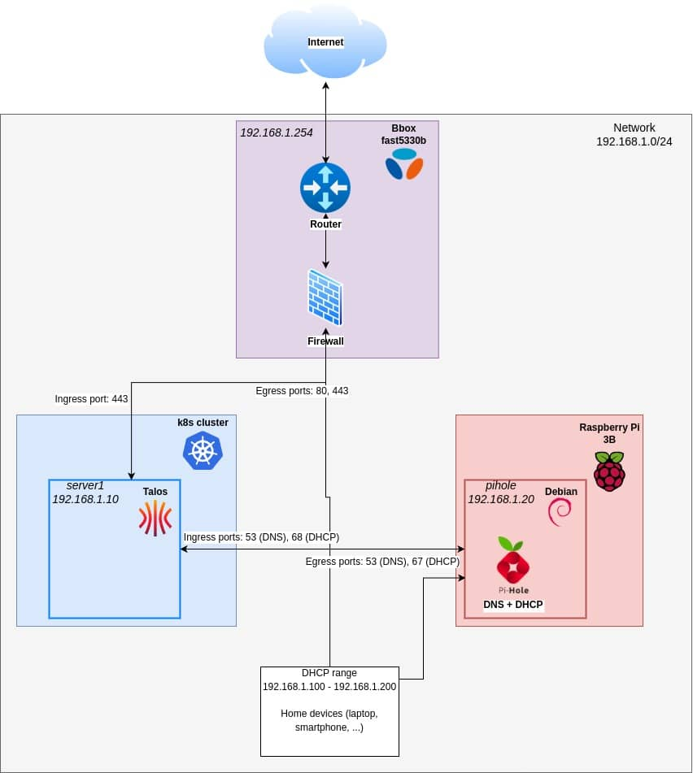

<div align="center">

# homelab-talos

This repository contains the configuration of my kubernetes homelab running on [Talos](https://www.talos.dev/).

</div>

## Preamble

My previous iteration of this cluster, also using GitOps can be found at `https://github.com/depp57/ops`.

<details>

I started this journey during the final year of my studies on October 1st 2023, after a 6-month internship at a company
specializing in Kubernetes and OpenShift. I loved the experience and wanted to learn more by building my own cluster.


I made three major mistakes:

- **Automated... But not enough.** When I moved from my apartment, I understood that I have not automated everything,
  and it will be painful to rebuild everything.
- **No backup for storage.** I lost my data when I moved.
- **All secrets were hardcoded in the git repo.** Initially, to save time, I hardcoded them, planning to address this later.
  Now, the repository is saturated with secrets, preventing me from making it public without first rewriting the entire Git history.

</details>

## Folder structure

```shell
├── 📂 doc          # Documentation
├── 📂 apps         # Applications
│   └── 📂 infra    # Infrastructure/system related apps (storage, ingress-controller, ...)
├── 📂 bootstrap    # Kubernetes bootstrap config
└── 📂 talos        # Talos OS configuration
```

## Deployment

I try to automate almost everything, keeping the deployment as simple as possible.

```shell
# 1. Clone the repo
git clone https://github.com/depp57/homelab-talos.git

# 2. Install the required tools:
#   - talosctl: Official Talos CLI
#       https://www.talos.dev/v1.11/talos-guides/install/talosctl/
#   - talhelper: Manage Talos configs declaratively
#       https://budimanjojo.github.io/talhelper/latest/installation/
#   - sops: Manage secrets in config files
#       https://github.com/getsops/sops/releases

# 3. Download the Talos Linux ISO with the required extensions (bare metal, amd64, secure boot enabled)
wget https://factory.talos.dev/image/613e1592b2da41ae5e265e8789429f22e121aab91cb4deb6bc3c0b6262961245/v1.11.0/metal-amd64-secureboot.iso

#   - Alternatively, you can download a base ISO without extensions here:
#       https://factory.talos.dev/
#   - Missing extensions will be automatically downloaded during step 7.

# 4. Boot your hardware using the ISO you just downloaded
#   Ensure secureboot is in 'setup' mode before booting Talos. The ISO bootloader will enroll the keys in the UEFI firmware

# 5. Once you'll see the Talos dashboard, unmount the ISO or unplug the USB drive
#   This prevents you from accidentally installing to the USB drive

# 6. Decrypt (or create) the bitwarden-secret.sops.yaml file, used by External Secrets Operator
sops decrypt bootstrap/external-secrets/bitwarden-secret.sops.yaml --output bootstrap/external-secrets/bitwarden-secret.yaml

# 7. List your disks, and choose which one to use for the installation
talosctl get disks --insecure --nodes <ip_address>
#   Then update ./talos/talconfig.yaml -> nodes.installDisk accordingly.

# 8. Generate and apply Talos config
cd talos
talhelper genconfig # Automatically uses talsecret.sops.yaml and decrypt it using sops
talosctl apply-config --insecure -n <ip_address> -- file ./clusterconfig/homelab-server1.yaml
cd ..

# 9. Save Talos config locally to avoid repeating --node and --endpoint parameters
talosctl config merge ./clusterconfig/talosconfig

# 10. Bootstrap the etcd cluster
talosctl bootstrap

# 11. Get kubernetes access through kubectl, either:
#   -> Merge your new cluster into your local Kubernetes configuration:
talosctl kubeconfig
#   -> Specify a filename if you prefer not to merge with your default Kubernetes configuration:
talosctl kubeconfig alternative-kubeconfig-name
```

And voilà! You can now run kubectl commands.

Thanks to `inlineManifests` defined in `./talos/talconfig.yaml`, **argoCD** is automatically deployed during bootstrapping.
ArgoCD will then take care of installing all other apps in the cluster.

Additionally, a Kubernetes Secret `bitwarden-access-token` is created in the `infra-external-secrets` namespace, which is
used by the operator to fetch secrets and create `Secret` from `ExternalSecret`.

In a few minutes, you'll get a running cluster with all workload up & running.

## Hardware

Currently, it is a single-node cluster.

|      **Device**      | **Hostname** | **RAM** |      **CPU**      | **Disk** | **GPU** |
|:--------------------:|:------------:|:-------:|:-----------------:|:--------:|:-------:|
| Intel NUC NUC10i3FNK | server1      | 32GB    | I3-10110U · 2C/4T | 1To NVMe | N/A     |

## Network diagram




# TODO

- think of a way to hide bot commits
- Automatic update dependencies with renovate
- explain DNS tricks for local LAN
- External Secrets Operator : delegates to a proper secret management tool (secret rotation, nice UI, etc.)
  - infisical (free plan) (or bitwarden with https://bitwarden.com/products/secrets-manager/#pricing?)
- auto backup etcd to s3 (explain why - longhorn storage)
- doc: metallb disabled since [Cilium replaces it](https://docs.cilium.io/en/stable/network/lb-ipam/).


# Disaster recovery

1. Plug USB key with ISO
2. getting started talos recipe
3. longhorn delete disk from node (UUID error)
4. longhorn recreate same disk
5. longhorn create disaster recovery volume